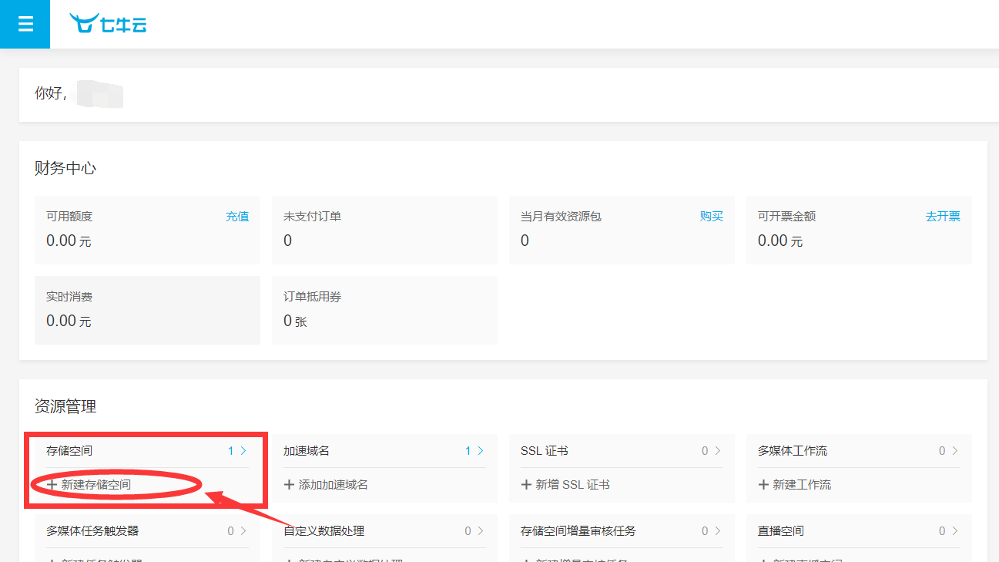
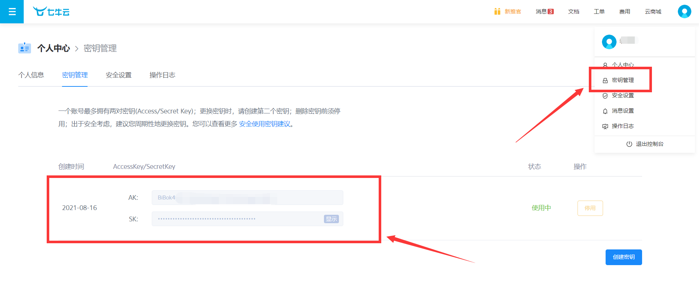

# 个人博客项目

#### 介绍
springboot项目，真实的在线博客系统。实现了登录注册、发布文章、分类查看文章、查看文章阅读数评论数、评论等功能。

文章编写采用md语法，文章中的图片存到七牛云服务器中。

#### 技术介绍
###### 前端
html，css，js，Vue

###### 后端
springBoot，mybatis-Plus，redis， Mysql，Lombok，maven

#### 软件架构
SSM（Spring+SpringMVC+Mybatis-plus）技术。

#### 安装教程
前端文件下载地址（阿里云盘）：https://www.aliyundrive.com/s/duTgEawZpqm

1.  需要先在本地启动前端项目（blog-app），在blog-app的目录中打开cmd命令窗，依次执行以下命令
    ~~~
    npm run build
    npm run dev
    ~~~
    
    出现以上页面前端页面启动成功。
2.  启动Redis服务器
3.  需要注册七牛云（免费使用），注册后在个人中心找到新建存储空间如下图所示

    新建好存储空间后，在个人中心找到密钥管理如下图
    
    将自己的密钥复制到application.properties文件的对应位置。
    
4.执行.sql文件。修改配置文件中自己MySQL的用户名和密码

5.启动后端项目，启动成功后访问localhost:8080即可

#### 博客界面展示

我的个人博客（非本开源博客）
https://blog.piaopiaoguangchang.cn/

